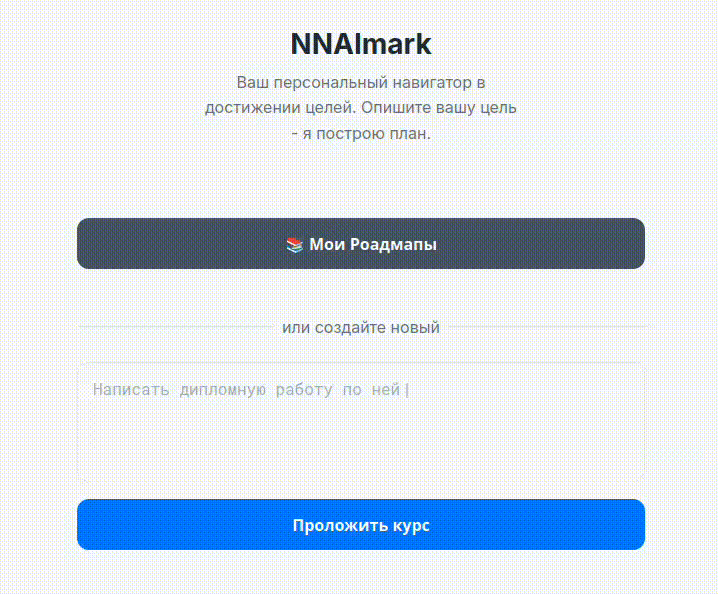

# NNAImark ✨ Ваш персональный AI-навигатор целей

    

**NNAImark** — это не просто таск-менеджер. Это интеллектуальный ассистент, интегрированный в мессенджер MAX как Mini App, который превращает ваши самые смелые идеи и амбициозные цели в конкретные, пошаговые и управляемые планы действий (роадмапы).


[**Бот в мессенджере Max**](https://max.ru/t166_hakaton_bot)





## 🎯 Концепция и решаемая проблема

В условиях высокой информационной нагрузки и быстрой смены задач студентам и молодым специалистам часто не хватает структурированного подхода к достижению больших целей, будь то изучение новой технологии, подготовка к стажировке или написание дипломной работы.

**NNAImark** решает эту проблему, выступая в роли персонального AI-наставника. Ключевая идея — не просто дать пользователю список задач, а с помощью нейросети GigaChat разбить абстрактную цель на логичные, последовательные и достижимые этапы. Это снижает когнитивную нагрузку, борется с прокрастинацией и превращает пугающую цель в увлекательное путешествие.

## 👥 Команда и вклад

| Участник          | Роль                   | Основной вклад                                      |
|-------------------|------------------------|-----------------------------------------------------|
| Боронин Фёдор     | Fullstack Developer    | Разработка API на FastAPI, настройка базы данных, интеграция с GigaChat, Docker-конфигурация, настройка Nginx. Проектирование и реализация UI/UX на React, логика взаимодействия с API, стилизация, адаптация под Mini App. |
| Босенко Тимофей     | Product Manager        |  Аналитика. Поиск и исследование проблемы, опросы и конкретизация решения. Презентация |


---

## 🚀 Запуск и Развертывание

Проект полностью контейнеризирован с помощью Docker, что делает его запуск невероятно простым и предсказуемым на любой машине.

### Пререквизиты
*   [Git](https://git-scm.com/)
*   [Docker](https://www.docker.com/products/docker-desktop/)
*   [Docker Compose](https://docs.docker.com/compose/install/)

### Пошаговая инструкция

1.  **Клонируйте репозиторий:**
    ```bash
    git clone https://github.com/Zzzpize/nnaimark-max.git
    cd nnaimark-max
    ```

2.  **Настройте переменные окружения:**
    Создайте файл `.env` в корне проекта, скопировав в него содержимое из `.env.example`. Затем заполните его вашими данными.
    ```bash
    cp .env.example .env
    ```
    Содержимое вашего `.env` файла должно выглядеть так:
    ```env
    # Токен вашего бота из платформы MAX
    MAX_BOT_TOKEN="ВАШ_MAX_BOT_TOKEN"
    
    # Username вашего бота (без @)
    MAX_BOT_NAME="ВАШ_БОТ_USERNAME"

    # Учетные данные для API GigaChat
    GIGACHAT_CREDENTIALS="ВАШИ_GIGACHAT_CREDENTIALS"

    # Токен для ngrok (получить на ngrok.com)
    NGROK_AUTHTOKEN="ВАШ_NGROK_AUTHTOKEN"

    # Этот URL генерируется ngrok после запуска. 
    # После первого запуска скопируйте URL из логов ngrok и вставьте сюда,
    # а затем укажите его в настройках вашего Mini App на платформе MAX.
    MINI_APP_URL="https://ВАШ_NGROK_URL.ngrok-free.dev"
    ```

3.  **Запустите все сервисы:**
    Эта команда соберет Docker-образы и запустит все необходимые сервисы в фоновом режиме.
    ```bash
    docker-compose up --build -d
    ```

4.  **Проверьте работу:**
    *   Посмотрите логи контейнеров: `docker-compose logs -f`
    *   Откройте туннель ngrok (`http://localhost:4040`) и убедитесь, что он активен.
    *   Найдите вашего бота в мессенджере MAX и отправьте ему команду `/start`.

> ### ⚠️ Важное замечание о доступе к ngrok
>
> На данный момент для доступа к ngrok с локальной машины или большинства хостингов **требуется VPN** с зарубежным IP-адресом, так как сервис прекратил работу на территории РФ. Участники хакатона узнали об этом только после того, как отправили организаторам ссылку на сайт.
>
> #### Альтернатива без VPN: `xtunnel`
>
> Проект легко адаптируется для работы через `xtunnel`. В любом случае, это решение для MVP - при построении полноценного приложения при продолжении работы над ним, будет использован качественный хостинг
>

---

## 🏛️ Архитектурные Особенности

Проект построен на современных и надежных принципах, обеспечивающих масштабируемость и простоту поддержки.

*   **Полная Контейнеризация:** `Docker` и `Docker Compose` изолируют каждый компонент системы (бэкенд, фронтенд, ngrok), гарантируя идентичность окружения на любой машине и упрощая развертывание до одной команды.

*   **Микросервисный подход:** Четкое разделение на `backend` (FastAPI) и `frontend` (React), которые общаются через REST API. Это позволяет независимо разрабатывать и масштабировать обе части приложения.

*   **Reverse Proxy с Nginx:** Фронтенд-контейнер использует `Nginx` не только для раздачи статических файлов React-приложения, но и как **обратный прокси**. Все запросы, начинающиеся с `/api/`, элегантно перенаправляются на бэкенд-сервис, решая проблему CORS и упрощая конфигурацию.

*   **Асинхронный бэкенд:** `FastAPI` позволяет обрабатывать запросы к GigaChat асинхронно, не блокируя основной поток и обеспечивая высокую отзывчивость API.

*   **Надежный AI-интерфейс:** В `gigachat_client.py` реализована система промпт-инжиниринга с использованием **XML-тегов** для передачи данных модели. Это значительно повышает надежность и точность получаемого JSON, минимизируя ошибки парсинга.

*   **Древовидная структура данных:** Модели `SQLAlchemy` спроектированы для хранения роадмапов в виде иерархического дерева, что позволяет легко реализовывать вложенные подзадачи любой глубины.

---

## 💡 Обоснование выбранного стека

Каждый инструмент был выбран для достижения максимальной скорости разработки и надежности — ключевых факторов на хакатоне.

*   **Backend: `FastAPI` (Python)**
    *   **Скорость:** Молниеносная производительность благодаря асинхронности и `pydantic`.
    *   **Простота:** Встроенная документация OpenAPI (Swagger) и строгая типизация ускоряют разработку и отладку.
    *   **Экосистема:** Огромное количество библиотек Python, включая `SQLAlchemy` и `gigachat-python`.

*   **Frontend: `React`**
    *   **Интерактивность:** Компонентный подход идеально подходит для создания сложных, динамичных интерфейсов, как наше дерево роадмапов.
    *   **Скорость разработки:** Огромное сообщество и библиотеки, такие как `@maxhub/max-ui`, позволяют быстро собирать красивый и консистентный UI.

*   **База данных: `SQLAlchemy` + `SQLite`**
    *   **Простота:** SQLite — это серверная база данных в одном файле, не требующая никакой настройки. Идеально для быстрого старта и портативности.
    *   **Мощность:** `SQLAlchemy` предоставляет мощный ORM, позволяя работать с базой данных через удобные Python-объекты.

*   **Развертывание: `Docker`, `Nginx`, `Ngrok`**
    *   **Надежность:** `Docker` гарантирует, что проект запустится у жюри точно так же, как у вас.
    *   **Производительность:** `Nginx` — один из самых быстрых и надежных веб-серверов для раздачи статики.
    *   **Доступность:** `Ngrok` — стандарт индустрии для демонстрации локально запущенных веб-сервисов.


---

## ⚙️ Производительность и Тестирование

### Локальное тестирование
Приведенные выше шаги по запуску полностью разворачивают рабочее окружение на локальной машине для тестирования всех функций в условиях, идентичных "боевым". Весь основной функционал был многократно проверен локально перед демонстрацией.

### Время отклика (Latency)
Производительность приложения зависит от двух ключевых операций, связанных с AI:

*   **Генерация начального роадмапа:** ~ **4-8 секунд**. Это время в основном определяется скоростью ответа API GigaChat на сложный запрос.
*   **Декомпозиция этапа (создание подзадач):** ~ **3-6 секунд**. Запрос проще, поэтому ответ приходит быстрее.

Все остальные операции (просмотр списка, открытие роадмапа, отметка шагов, удаление) выполняются **мгновенно** (< 200 мс), так как зависят только от скорости работы локальной базы данных и API.

### Подход к тестированию
В условиях ограниченного времени хакатона основной упор был сделан на **ручное End-to-End тестирование** ключевых пользовательских сценариев:
1.  Успешная инициализация Mini App и получение ID пользователя.
2.  Создание нового роадмапа по текстовому запросу.
3.  Корректное отображение списка роадмапов с прогрессом.
4.  Открытие, просмотр и навигация по дереву шагов.
5.  Декомпозиция шага на подзадачи.
6.  Изменение статуса выполнения шага (`is_done`).
7.  Поиск по списку роадмапов.
8.  Удаление роадмапа.

**Планы на будущее:** При дальнейшей разработке планируется внедрение автоматизированного тестирования:
*   **Backend:** Unit-тесты для API с использованием `PyTest`.
*   **Frontend:** Компонентные и E2E-тесты с использованием `Cypress` или `Playwright`.